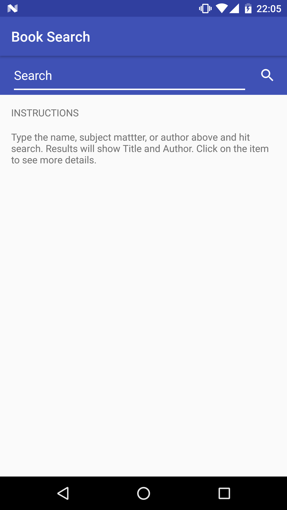
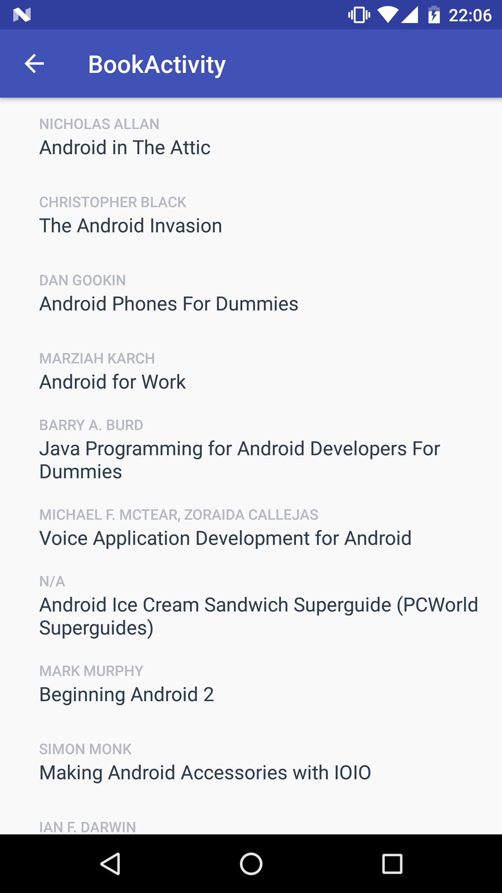

# Android Book Listing
- Project **Book Listing** of Android Basics Nanodegree
- [Android Basics Nanodegree at Udacity.com](https://www.udacity.com/course/android-basics-nanodegree-by-google--nd803).

## Android Goodies
- HttpURLConnection.
- Loader.
- AsyncTask.
- JSON Parsing.
- ArrayAdapter.
- ListView.
- POJO.

# Description
- Search books by any attribute. 
- Retrieves data from Google Books API. 
- Only the first 10 results will be displayed. 

# Screenshot
  